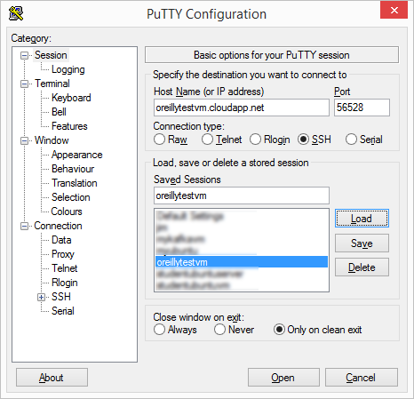

# ALARM (Azure Linux Resource Manager)

The purpose of alarm is to enable ISVs to better enable license key management on customer virtual machines.

Easier for parnters to onboard to the marketplace.

- There are partners in the Azure Marketplace that have two models for monetization
	- The first is a BYOL model 
    - The second is a paid customer support model for their open source products. 
- Currently, it is not easy to deploy some of these solutions in the marketplace 
- The expectation is that the customer will remote into the VM and install the license key(s) that they purchased
- Another issue is customer discovery
- There is no mechanism that tells the partner which customers have provisioned software from the partner and which license keys are being used
- There is also no mechanism to determine per hour CPU usage


## How this content can help

The purpose of this content is to enable your customers to quickly and easily place the license keys in virtual machines that they provision.

- Your customers will need to use the Azure resource manager to do their provisioning
- This document will help you simplify replacements of life in school on provisioned virtual machines
- Your customers will:
	- Need to begin by provisioning a Linux virtual machine through the portal
	- Install the Azure cross platform tooling on the Linux VM
	- Will clone this repository to the Linux VM
	- Make necessary changes to azuredeploy.json to include customer information as well as license key information


## Getting Setup

If you don't already have one, one of the first things you'll need to do is provision a Linux VM:
- This Linux VM will be used to provision a cluster
- We will install the Azure cross platform tooling on it
- We will also clone this repository to it
- It will enable us to leverage the two important files used in the provisioning process
	- azuredeploy.json
	- azuredeploy.parameters.json

If you already have a Linux VM, skip to the **Installing the cross-platform tooling** section.


#### Getting the connection information of the VM

Once you have provisioned this virtual machine, you will need to gather its connection information:
- The IP address
- The port number


#### SSH into the VM (Putty for Windows Users)

From there you will need to remotely connect into that virtual machine. MacOS has built them as SSH capabilities. Windows requires you to install the Putty application. MacOS users simply **ssh** from a console window.




#### Installing the cross-platform tooling

Your next goal is to install the Azure cross-platform tooling. For Ubuntu images. This is simply a matter of issuing the following commands:

**Ubuntu**
```
sudo apt-get update
sudo apt-get install nodejs-legacy
sudo apt-get install npm
sudo npm install -g azure-cli
``` 
**RPM Based (CentOS)
```
su – 
yum update [enter] 
yum upgrade –y [enter] 
yum install epel-release [enter] 
yum install nodejs [enter] 
yum install npm [enter] 
npm install -g azure-cli [enter]
```


#### Testing the cross platform tooling

If tooling was successful, you will just need to type in the following command

````
azure --help
````


## Understanding how to install licensing keys on all provisioned VMs

The following steps will get your started:

- Remote into the Ubuntu Image that we previously created
	- Login as superuser (sudo -s)
- Clone the repo
	- git clone https://github.com/brunoterkaly/alarm.git
- cd alarm/byol-singlevm
	- Review the following files
		- azuredeploy.json  
		- azuredeploy.parameters.json  
		- deploy.bat  
		- install_license.sh

#### Make the necessary changes

There are a few things to keep in mind when installing license keys. The license key is found in **azuredeploy.parameters.json.** You can have customers put this in there themselves. The partner will need to provide the appropriate **install_license.sh** script at the http endpoint inside of **azuredeploy.json**.


#### You will need to modify the following files:

**azuredeploy.json**

Both the partner and the customer will play a role here.

- Partner
	- Provide an appropriate install_license.sh script.
- Customer
	- Modify the variables section to indicate such things as VM name, VM size, and other attributes relating to naming, networking, storage, and more.


 modify the VMExtensions area as needed. You fill need to modify the **fileUris** section to point to the correct **install_license.sh** install script. The VM Extensions are a key component to be able to run BASH scripts after the VM is provisioned.

```json
{
        "type": "Microsoft.Compute/virtualMachines/extensions",
        "name": "[concat(variables('vmName'), copyIndex(), '/newuserscript')]",
        "copy": {
             "name": "virtualMachineLoop",
              "count": "[parameters('numberOfNodes')]"
        },
        "apiVersion": "2015-05-01-preview",
        "location": "[variables('location')]",
        "dependsOn": [
            "[concat('Microsoft.Compute/virtualMachines/', variables('vmName'), copyindex())]"
        ],
        "properties": {
            "publisher": "Microsoft.OSTCExtensions",
            "type": "CustomScriptForLinux",
            "typeHandlerVersion": "1.2",
            "settings": {
                "fileUris": [
                    "https://raw.githubusercontent.com/brunoterkaly/alarm/master/byol-multivm/install_license.sh"
                ],
                "commandToExecute": "[concat('sh install_license.sh ', parameters('licenseKey'))]"
            }
        }
    }
```

You can also modify the **variables** section to reflect vm name, vm size, and other attributes relating to naming, networking, storage, and more.

```json
 "variables": {
        "location": "West US",
        "imagePublisher": "Canonical",
        "imageOffer": "UbuntuServer",
        "OSDiskName": "osdiskforlinuxsimple",
        "nicName": "myVMNic",
        "addressPrefix": "10.0.0.0/16",
        "subnetName": "Subnet",
        "subnetPrefix": "10.0.0.0/24",
        "storageAccountType": "Standard_LRS",
        "publicIPAddressName": "myPublicIP",
        "publicIPAddressType": "Dynamic",
        "vmStorageAccountContainerName": "vhds",
        "vmName": "btubun2",
        "vmSize": "Standard_D1",
        "virtualNetworkName": "MyVNET",
        "vnetID": "[resourceId('Microsoft.Network/virtualNetworks',variables('virtualNetworkName'))]",
        "subnetRef": "[concat(variables('vnetID'),'/subnets/',variables('subnetName'))]"
    },

```


**azuredeploy.json**

You modify the VMExtensions area as needed. You fill need to modify the 


We will use ARM templates and BASH script to install license keys on all provisioned VMs.

We will need to 


 

## Getting Setup


## Getting Setup


## Getting Setup


