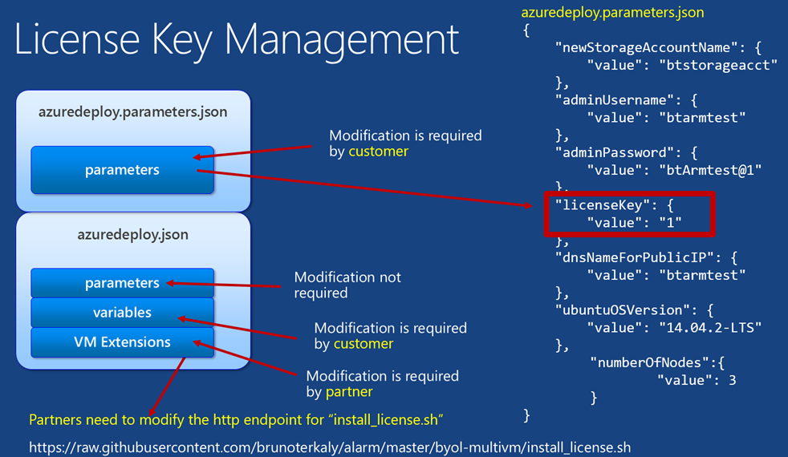

# ALARM (Azure Linux Resource Manager)

The purpose of alarm is to enable ISVs to better enable license key management on customer virtual machines.

Easier for parnters to onboard to the marketplace.

- There are partners in the Azure Marketplace that have two models for monetization
	- The first is a BYOL model 
    - The second is a paid customer support model for their open source products. 
- Currently, it is not easy to deploy some of these solutions in the marketplace 
- The expectation is that the customer will remote into the VM and install the license key(s) that they purchased
- Another issue is customer discovery
- There is no mechanism that tells the partner which customers have provisioned software from the partner and which license keys are being used
- There is also no mechanism to determine per hour CPU usage


## High level steps

This document will go over some detail steps in deploying license files to Linux VMs. 

- It begins by getting access to a Linux computer that will be used to execute the provisioning process. 
- The provisioning process will begin by installing the Azure cross platform client tools on the Linux computer.
-  Next, the necessary installation scripts and provisioning artifacts will be downloaded from Github using the git clone command. 
	-  Some modifications will need to be made from this downloaded content. Both the partner as well as the customers and the partner will need to make these modifications. The partner defines the way the license file gets copied to the provisioned Linux VM. 
-  But it is the end customer that runs the provisioning process. It will the customer that places the license key, and defines the attributes of the provisioned infrastructure, physically kick off the provisioning process.


## How this content can help

The purpose of this content is to enable your customers to quickly and easily place the license keys in virtual machines that they provision.

- Your customers will need to use the Azure resource manager to do their provisioning
- This document will help you simplify replacements of life in school on provisioned virtual machines
- Your customers will:
	- Need to begin by provisioning a Linux virtual machine through the portal
        - If the don't already have a Linux computer
	- Install the Azure cross platform tooling on the Linux VM
	- Will clone this repository to the Linux VM
	- Make necessary changes to azuredeploy.json to include customer information as well as license key information


## Getting Setup

If you don't already have one, one of the first things you'll need to do is provision a Linux computer:
- This Linux VM will be used to provision a cluster
- We will install the Azure cross platform tooling on it
- We will also clone this repository to it
- It will enable us to leverage the two important files used in the provisioning process
	- azuredeploy.json
	- azuredeploy.parameters.json

If you already have a Linux VM, skip to the **Installing the cross-platform tooling** section.


#### Getting the connection information of the VM

This applies to those who don't have a Linux computer to run the provisioning process.

Once you have provisioned this virtual machine, you will need to gather its connection information:
- The IP address
- The port number


#### SSH into the VM 

Skip this step if you already are logged into a Linux VM.

From there you will need to remotely connect into that Linux virtual machine. MacOS has built them as SSH capabilities. Windows requires you to install the Putty application. 


## Installing the cross-platform tooling

Your next goal is to install the Azure cross-platform tooling. For Ubuntu images. This is simply a matter of issuing the following commands. Note that there are different commands, depending on whether you have Ubuntu or RPM-based Linux distributions.

**Ubuntu**
```
sudo apt-get update
sudo apt-get install nodejs-legacy
sudo apt-get install npm
sudo npm install -g azure-cli
``` 
**RPM Based (CentOS)**
```
su – 
yum update [enter] 
yum upgrade –y [enter] 
yum install epel-release [enter] 
yum install nodejs [enter] 
yum install npm [enter] 
npm install -g azure-cli [enter]
```


#### Testing the cross platform tooling

If tooling was successful, you will just need to type in the following command

````
azure --help
````
You should see a number of commands that are available to the Azure cross platform tooling.


## Understanding how to install licensing keys on all provisioned VMs

Now that we have a Linux computer from which we can execute the provisioning process, let's take a deeper look at how all the pieces fit together.


The following steps will get your started. 


1. Remote into the Ubuntu Image that we previously created
	1. Login as superuser (sudo -s)
1. Run the git clone command to get all the provisioning artifacts on your local Linux computer ( for the Linux VM you provisioned in Azure )
    1. git clone https://github.com/brunoterkaly/alarm.git
1. Change directory to alarm/byol-singlevm.
    1. Review the following files. It is these files that we will modify. Remember that both the partner as well as the customer will make these modifications.
		1. azuredeploy.json  
		1. azuredeploy.parameters.json  
		1. deploy.bat  
		1. install_license.sh


#### Some key points to note about the modifications you will make as a partner and a customer

There are a few things to keep in mind when installing license keys. The license key is found in **azuredeploy.parameters.json.** You can have customers put this in there themselves. The partner will need to provide the appropriate **install_license.sh** script at the http endpoint inside of **azuredeploy.json**.




#### You will need to modify the following files:

**azuredeploy.json**

Both the partner and the customer will play a role here.

- Partner
	- Provide an appropriate install_license.sh script.
- Customer
	- Modify the variables section to indicate such things as VM name, VM size, and other attributes relating to naming, networking, storage, and more.

The **partner** will need to modify the VMExtensions area as needed. You fill need to modify the **fileUris** section to point to the correct **install_license.sh** install script. The VM Extensions are a key component to be able to run BASH scripts after the VM is provisioned. The partner will modify the install_license.sh script as needed for their business.

```json
{
        "type": "Microsoft.Compute/virtualMachines/extensions",
        "name": "[concat(variables('vmName'), copyIndex(), '/newuserscript')]",
        "copy": {
             "name": "virtualMachineLoop",
              "count": "[parameters('numberOfNodes')]"
        },
        "apiVersion": "2015-05-01-preview",
        "location": "[variables('location')]",
        "dependsOn": [
            "[concat('Microsoft.Compute/virtualMachines/', variables('vmName'), copyindex())]"
        ],
        "properties": {
            "publisher": "Microsoft.OSTCExtensions",
            "type": "CustomScriptForLinux",
            "typeHandlerVersion": "1.2",
            "settings": {
                "fileUris": [
                    "https://raw.githubusercontent.com/brunoterkaly/alarm/master/byol-multivm/install_license.sh"
                ],
                "commandToExecute": "[concat('sh install_license.sh ', parameters('licenseKey'))]"
            }
        }
    }
```
_azuredeploy.json_

You can also modify the **variables** section to reflect vm name, vm size, and other attributes relating to naming, networking, storage, and more.

```json
 "variables": {
        "location": "West US",
        "imagePublisher": "Canonical",
        "imageOffer": "UbuntuServer",
        "OSDiskName": "osdiskforlinuxsimple",
        "nicName": "myVMNic",
        "addressPrefix": "10.0.0.0/16",
        "subnetName": "Subnet",
        "subnetPrefix": "10.0.0.0/24",
        "storageAccountType": "Standard_LRS",
        "publicIPAddressName": "myPublicIP",
        "publicIPAddressType": "Dynamic",
        "vmStorageAccountContainerName": "vhds",
        "vmName": "btubun2",
        "vmSize": "Standard_D1",
        "virtualNetworkName": "MyVNET",
        "vnetID": "[resourceId('Microsoft.Network/virtualNetworks',variables('virtualNetworkName'))]",
        "subnetRef": "[concat(variables('vnetID'),'/subnets/',variables('subnetName'))]"
    },

```
_azuredeploy.json_

#### Modifying azuredeploy.parameters.json

Key points when modifying:

- The customer will modify this file
- Important information is here
- Customers will input the license key they obtain from the partner
- Customers will want to modify login credentials, and potentially other parameters:
	- newStorageAccountName 
	- adminUsername 
	- adminPassword 
	- licenseKey 
	- dnsNameForPublicIP 
	- ubuntuOSVersion 
	- numberOfNodes

```json
{
    "newStorageAccountName": {
        "value": "btstorageacct"
    },
    "adminUsername": {
        "value": "btarmtest"
    },
    "adminPassword": {
        "value": "btArmtest@1"
    },
    "licenseKey": {
        "value": "1"
    },
    "dnsNameForPublicIP": {
        "value": "btarmtest"
    },
    "ubuntuOSVersion": {
        "value": "14.04.2-LTS"
    },
	"numberOfNodes":{
		"value": 3
	}
}

```
_azuredeploy.parameters.json_


#### install_license.sh

This vast found these to be at the end of an http endpoint. This is an obvious security concern and it is recommended that this script be placed behind a company firewall.

```bash
#!/bin/sh
# Custom BYOL install script for Ubuntu 14.02
# $1 = licenseKey

logger "Installing License"

licenseKey=$1

echo $licenseKey >> /tmp/licensefile.txt

````


## The customer provisioning process. Executing the deployment. 

Once the modifications are made to azuredeploy.json and azuredeploy.parameters.json files have been made, the customer is ready to provision their VMs, networks, storage, and more.

- The Azure Cross-Platform tooling is needed
- Both partner and customer have updated azuredeploy.json and azuredeploy.parameters.json.

The diagram below illustrates the command line. For more context, see https://azure.microsoft.com/en-us/documentation/articles/virtual-machines-deploy-rmtemplates-azure-cli/.

The diagram below illustrates:

- Executing the XPlat CLI command:

```
$ azure group create “myRGroup" "West US" -f azuredeploy.json -d “myDeploy" -e azuredeploy.parameters.json
```


Notice the **azure group create** command. The assumption made here is the customer has made the necessary modifications to azuredeploy.json and azuredeploy.parameters.json. In addition, the partner has made changes to azuredeploy.json and install_license.sh.

 
The **azure group create...** command works as follows:

- It takes the parameters file and the template file and generates a deployment.
- azuredeploy.parameters.json
	- Parameters file 
- azuredeploy.json
	- Template file 


If you go to http://portal.azure.com, you can see your deployment:
- Note that this is the **byol-multivm** version
- This repo also provides **byol-singlevm** version


## Validating successful deployment

Once you have kicked off the deployment, it may take a few moments for the deployment to successfully complete. This next section is designed for the customer wanting to validate successful deployment.

Start by navigating to the portal (http://portal.azure.com)


From the portal, select, browse, resource groups, MyResourceGroup.


You'll notice that we have provisioned a three node cluster, complete with 3 VMs, 3 nic cards, and 3 public IP addresses.


Now we need to drill down into the virtual machine to get its public IP from the portal so that we can remote in and validate that the license file has been successfully been installed the /tmp directory.


The image below proves the deployment was a success because you can see the license file in the /tmp folder. This file will appear in the in each and every VM that got deployed.


## Video walk-through of the process

The following brief video takes you through some of the considerations outlined above.

## Additional resources


